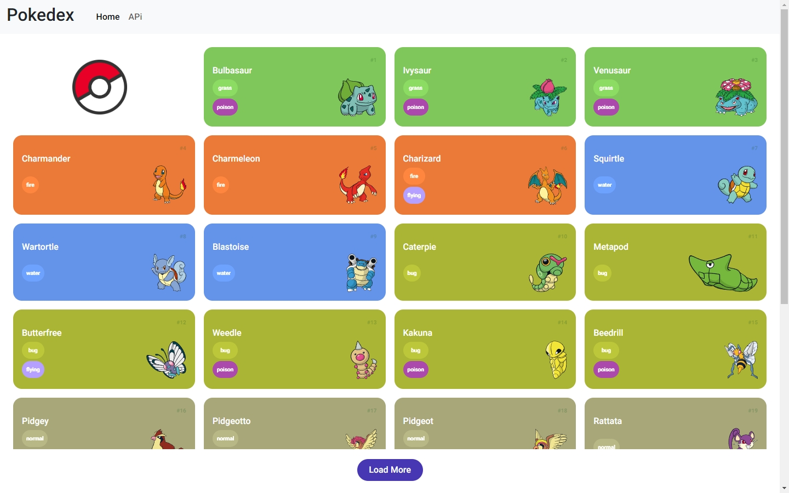
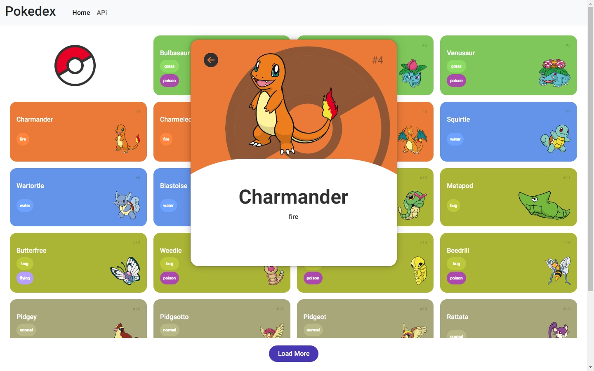
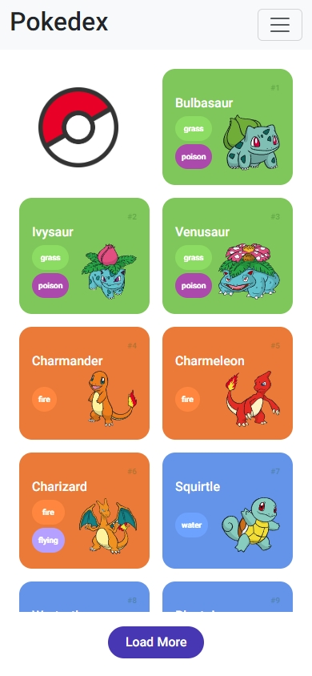
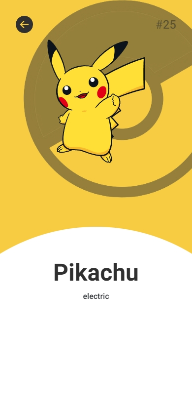

# Pokedex

### Projeto obrigatório para todo Dev em formação 😂

<div align="left">
  <div align="left">
  
  
  
  
  
    
  
</div>

###



> Usando a API pokeapi.co , desenvolvi essa listagem de pokemons usando JavaScript.

### API

<a href="https://pokeapi.co/docs/v2#pokemon-section" ></a>

> Clique e acesse a documentação 


## 🚀 Instalando

Windows:

```
git clone https://github.com/Joaommsp/pokedex.git
```

```
cd pokedex
```

```
use a extensão Live Server do VS CODE ou semelhante para executar o projeto em um servidor local ( localhost )
```


## 💻 Um pouco do projeto




## 📱 Mobile

<table>
  <tr>
    <td></td>
    <td></td>
  </tr>
</table>

## 🔗 Deploy

Clique e acesse o projeto hospedado no Github pages

<div align="left">
 <a href="https://joaommsp.github.io/pokedex/"></a>
</div>

## 🤓 Me acompanhe para mais projetos


